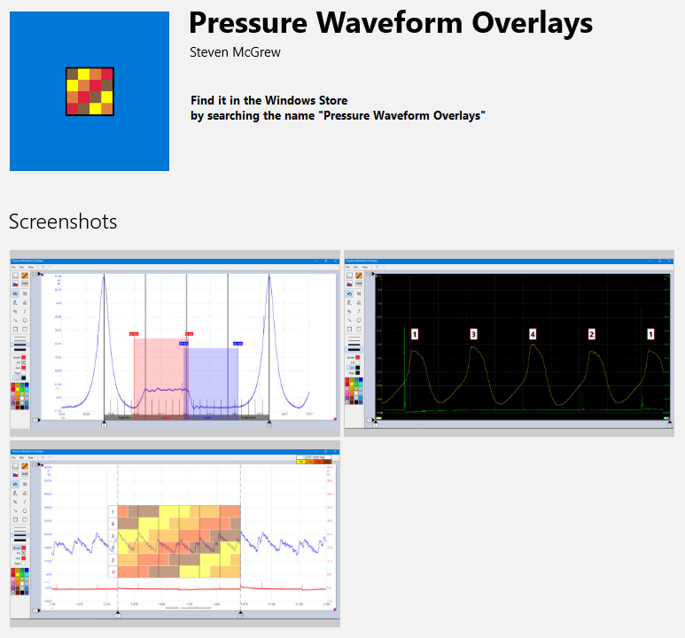

# WaveformOverlaysPlus

This UWP app is designed for desktop computers with mouse and keyboard.

Automotive Technicians who use oscilloscopes to capture and analyze waveforms can use this app to open their waveform images and apply an overlay to make measurements. Overlays include: Compression, Cylinder ID, and Labels. In addition, there are options for adding TextBox notes, Arrows, Lines, Drawing with Pen, and Shapes.
